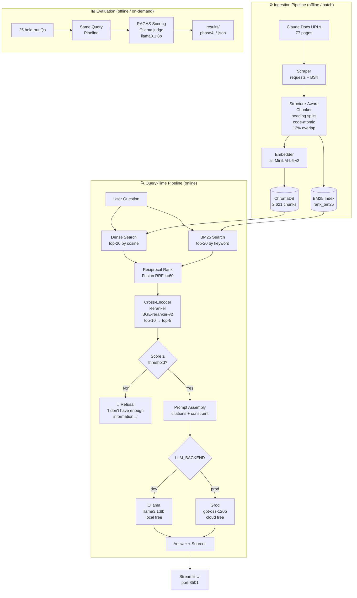

# 🚀 Colophon — Production RAG Knowledge Assistant

[](https://github.com/your-username/colophon/actions)
[](https://www.python.org/downloads/)
[](https://fastapi.tiangolo.com)
[](https://streamlit.io)
[](https://opensource.org/licenses/MIT)

Welcome to **Colophon**, a blazing-fast, production-ready Retrieval-Augmented Generation (RAG) assistant designed specifically for the **Anthropic Claude API documentation** (`platform.claude.com/docs`). 

Ever wished you could just *talk* to documentation? Now you can! Grounded strictly in retrieved source documentation with inline citations, Colophon uses hybrid search, reciprocal rank fusion, and cross-encoder reranking to deliver pristine, hallucination-free answers. 🧠✨

> **🏆 Verified results — 25-question held-out eval, Ollama judge, Sep 2026:**
> Recall@5 = **0.90** | Faithfulness = **0.706** | Context Precision = **0.861** | OOD Refusal Accuracy = **1.00**

---

## 🎯 What Makes Colophon Special?

- **📚 Targeted Corpus:** Master of the Anthropic Claude API (Messages API, Tool Use, Extended Thinking, Structured Outputs, Streaming, Prompt Caching, Prompt Engineering, MCP, Models & Pricing) — 77 pages, 2,621 meticulously processed chunks.
- **🔪 Smart Structure-Aware Chunking:** It doesn't just slice text randomly. It splits along Markdown hierarchies (`##`/`###`) while keeping your precious code blocks completely intact!
- **🕵️‍♂️ Hybrid Retrieval (The Best of Both Worlds):** Merges dense semantic vector search (`all-MiniLM-L6-v2`) with sparse exact-match BM25 search. Why? Because pure semantic search often misses crucial API identifiers like `tool_choice` or `cache_control`. We catch them all!
- **🔀 Reciprocal Rank Fusion (RRF):** Flawless score-agnostic rank normalization with a $k=60$ smoothing constant.
- **🎯 Cross-Encoder Reranking:** Takes the top candidates and ruthlessly re-scores them using `BAAI/bge-reranker-v2-m3` before the LLM even sees them.
- **🛡️ Zero-Hallucination Guardrails:** If it doesn't know, it won't guess. Strict confidence thresholding ensures explicit refusals for out-of-domain queries.
- **🔄 Dev/Prod Dual Backend:** Seamlessly switch between local **Ollama** (`llama3.1:8b`) for free local dev and cloud **Groq** (`openai/gpt-oss-120b`) for blistering production speed with a simple `.env` flag!

---

## 🏛️ System Architecture

*(How the magic happens)*



---

## 📂 The Grand Repository Layout

Here is the map to our treasure trove! Pay special attention to the hidden gems like `.agents`, `.claude`, and `SRS`.

```text
colophon/
├── .agents/            # 🤖 AI Agent configurations and specialized prompt rules
├── .claude/            # 🧠 Claude-specific instructions and workspace context
├── .github/            # 🐙 CI/CD pipelines and GitHub Actions workflows
├── .env                # 🔐 The Vault! Contains your critical API keys (ignored in Git)
├── SRS/                # 📐 Software Requirements Specifications and core design docs
├── src/
│   ├── ingestion/      # Data gathering and chunking logic
│   ├── retrieval/      # The search brains: BM25, Vectors, RRF, and Reranking
│   ├── generation/     # LLM backends (Ollama/Groq) and prompts
│   ├── api/            # FastAPI app routing and schemas
│   ├── evaluation/     # RAGAS eval harness and benchmarks
│   └── config.py       # Centralized env-driven configuration
├── frontend/           # Legacy Streamlit web interface
├── frontend-web/       # 🌟 The gleaming new Next.js frontend!
├── tests/              # Unit and integration tests guaranteeing perfection
├── docker/             # Containerization magic
├── requirements.txt    # Python dependencies
└── README.md           # You are here! 📍
```

---

## 🚀 Ready for Liftoff? Getting Started

### 🛠️ Prerequisites
- Python 3.11+
- Node.js 20+ and npm (for the spectacular Next.js frontend)
- [Ollama](https://ollama.ai) for local dev (optional — Groq works without it)
- Free [Groq API Key](https://console.groq.com) for production inference

### 📦 Installation
```bash
git clone https://github.com/your-username/colophon.git
cd colophon

# Setup the Python backend brain
python -m venv venv
source venv/bin/activate
pip install -r requirements.txt

# Setup the beautiful Next.js frontend
cd frontend-web && npm install && cd ..
```

### 🔐 Environment Configuration
Never commit your secrets! They belong safely in `.env`.
```bash
cp .env.example .env
```
Edit `.env` to unlock the power:
```ini
LLM_BACKEND=groq              # "ollama" for local dev, "groq" for prod
GROQ_API_KEY=gsk_...          # 🔑 Your precious Groq API Key!
OLLAMA_MODEL=llama3.1:8b      # Used if LLM_BACKEND=ollama
```

### ⚡ Running the Application

**Local Magic (Backend + Frontend):**
```bash
# Terminal 1 — Fire up the FastAPI backend
uvicorn src.api.main:app --host 0.0.0.0 --port 8000 --reload

# Terminal 2 — Launch the Next.js frontend (http://localhost:3000)
cd frontend-web
cp .env.local.example .env.local   # first time only
npm install
npm run dev
```

**Docker (API only):**
```bash
docker-compose -f docker/docker-compose.yml up --build
```

Access the interactive API docs at **http://localhost:8000/docs**.

---

## 🧪 Bulletproof Testing

Run the test suite and watch the green checkmarks roll in!
```bash
pytest tests/ -v
# 20 tests, all pass. Flawless victory. 🏆
```

---

## 💬 See it in Action (Example Queries)

**🎯 In-domain — Brilliant cited answer:**
```bash
curl -s -X POST http://localhost:8000/query \
  -H "Content-Type: application/json" \
  -d '{"question": "How do I force Claude to use a specific tool?"}' | jq .answer
# → "Use the tool_choice parameter with type='tool' and specify the name..."
```

**🚫 Out-of-domain — The Guardrail triggers:**
```bash
curl -s -X POST http://localhost:8000/query \
  -H "Content-Type: application/json" \
  -d '{"question": "How do I book a flight on Delta Airlines?"}' | jq '{context_found, answer}'
# → {"context_found": false, "answer": "I don't have enough information..."}
```
*Tested on 5 OOD questions — 5/5 correct refusals in the final production config. We don't hallucinate here.*

---

## 📊 Evaluation Results (The Hard Numbers)

Phase 4 ablation study — 25 held-out questions. All stages verified at **0 generation errors** before RAGAS scoring.

| Stage | Retrieval | Rerank | Recall@5 | OOD Acc | Faithfulness | Ans Relevancy | Ctx Precision | Ctx Recall |
|---|---|---|---|---|---|---|---|---|
| Baseline | Vector-only | — | 0.800 | 1.000 | 0.608 | 0.677 | 0.748 | 0.997 |
| + Chunking | Vector-only | — | 0.800 | 1.000 | 0.685 | 0.651 | 0.748 | 0.997 |
| + Hybrid | Hybrid | — | 0.900 | 1.000 | 0.564 | 0.748 | 0.799 | 0.950 |
| **+ Reranking (Production)** | **Hybrid** | **BGE-v2-m3** | **0.900** | **1.000** | **0.706** | **0.746** | **0.861** | **0.937** |

**🔍 Key Insights:**
- **Hybrid Retrieval is King:** It catches exact API identifiers that semantic search misses (+0.10 Recall@5).
- **Reranking Polishes the Diamond:** Improves context precision by surfacing the most answer-relevant chunks before LLM context assembly.

---

## ⚖️ Technical Trade-offs (Why we did it this way)

| Decision | Chosen | Rationale |
|---|---|---|
| Corpus | Anthropic Claude API docs | High-quality technical docs without an existing competing doc-AI |
| Chunking | Structure-aware | Preserves heading structure and critical code blocks |
| Search | Hybrid dense + BM25 | BM25 catches exact API names (`tool_choice`) that vectors miss |
| Fusion | RRF (k=60) | Score-agnostic rank normalization |
| Generation | Groq (prod) / Ollama (dev) | Zero-cost inference with a single `.env` switch |

---

## ⚠️ Known Limitations

- **Latency:** Free CPU hosting means p95 ≈ 11s (reranker is the bottleneck). Acceptable for a demo, upgrade for prod!
- **Corpus Scope:** Limited to `platform.claude.com/docs`. It won't answer questions about other Anthropic products.
- **Groq Free Tier:** 200k tokens/day. Perfect for demo scale!

---

## 📄 Legal & Disclaimer

*This project is an independent portfolio demonstration and is not affiliated with, endorsed by, or sponsored by Anthropic PBC. Documentation excerpts used for indexing are for personal educational purposes under fair use.*
